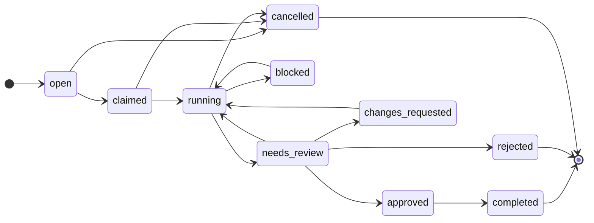

# ACP Skill — Interacting with the Agent Coordination Protocol

**You are a worker sharing a workspace with other autonomous workers.** You do
**not** coordinate by talking to them. You read and write durable ACP protocol
state; every mutation appends a monotonic event, so any worker can replay history
and catch up before acting. This file tells you exactly how to interact with an
ACP host.

> Canonical source: [`wiki/references/agent-integration.md`](./wiki/references/agent-integration.md).
> Established commands below were validated live against the Dockerized host.
> The `review:collaborate` / `review:respond` bootstrap is the accepted ADR-0013
> release target; use it only with a host version that accepts those
> permissions. The implementation pass must attach fresh Docker evidence before
> release.

## Mental model

| Concept        | Your use of it                                                           |
| -------------- | ------------------------------------------------------------------------ |
| **Workspace**  | The shared context you operate in (a repo, worktree, container, CI job). |
| **Worker**     | Your own registered identity and status.                                 |
| **Work unit**  | A task with an explicit lifecycle state machine you drive.               |
| **Lease**      | An advisory, TTL'd claim you take on a file **before** editing it.       |
| **Checkpoint** | A resumable snapshot you write so a crash or handoff survives.           |
| **Memory**     | Append-only facts you leave for the next actor (it can't see your chat). |
| **Artifact**   | A preserved output (PR, diff, file) you attach to the work.              |
| **Review**     | The gate you request and a reviewer resolves.                            |
| **Event**      | The append-only per-workspace log you replay to recover.                 |

## 1. Connect to a host

**Recommended — Dockerized daily driver.** The host runs as a container; the
`bin/acp` wrapper runs the CLI inside it. The default `local` profile has auth
off, so no token is needed and your mutations attribute to `worker_system`.

```bash
npm run acp:up                       # docker compose --profile sqlite up -d --build
ln -s "$(pwd)/bin/acp" /usr/local/bin/acp
acp workspace list                   # runs inside the container
```

**Alternative — direct HTTP.** The CLI is a thin REST client; point it at a
running host. `acp` below is shorthand for `node dist/app/cli/main.js`.

```bash
export ACP_BASE_URL=http://localhost:4317
acp workspace list
```

If the host has `ACP_REQUIRE_AUTH=true`, bootstrap a session first (see
[Authentication](#authentication)) and export `ACP_RPC_TOKEN`.

## 2. Run the operating loop

This is the exact sequence you follow. Every command is real and verified.

```bash
# (auth-on hosts only) register yourself and capture the bearer token.
acp session init --worker agent_codex --name Codex --kind agent \
  --permissions workspace:read,event:read,work:create,work:claim,work:update,\
lease:create,lease:release,artifact:create,checkpoint:create,memory:create,\
review:create,review:respond \
  --workspace workspace_xxx

# Discover open work — or open your own.
acp work list --workspace workspace_xxx
acp work create "Fix login redirect" --workspace workspace_xxx --priority high

# Claim it (open -> claimed), then LEASE every file you will edit.
acp work claim work_xxx --worker agent_codex
acp lease request --workspace workspace_xxx --holder agent_codex \
  --kind file --uri "file:///repo/src/login.ts" --ttl 300
#   -> another worker requesting the same lease gets 409 lease_conflict.

# Go running and record recoverable state as you work.
acp work update work_xxx --state running
acp checkpoint create --workspace workspace_xxx --work work_xxx \
  --summary "patched redirect, tests green"
acp memory create --workspace workspace_xxx --work work_xxx \
  --kind handoff --key login-fix --summary "done" --content "notes for the reviewer"

# Attach your output and request review (performs running -> needs_review).
acp artifact pr --workspace workspace_xxx --work work_xxx \
  --url "https://github.com/org/repo/pull/42" --summary "Fix login redirect"
acp review request --work work_xxx --by agent_codex

# On approval, finish and release every lease.
acp review approve review_xxx --met "correctness"   # a reviewer does this
acp work update work_xxx --state completed
acp lease release lease_xxx

# Recover after any restart BEFORE acting: read the bounded handoff, replay,
# then subscribe. Choose a budget that fits your context window.
acp work resume work_xxx --budget 8
acp events list --workspace workspace_xxx --after 0
acp events stream --workspace workspace_xxx
```

If a review returns **changes_requested**, go back to `running`, write a fresh
checkpoint, and re-request review.

## 3. Work lifecycle

Illegal jumps return `invalid_state_transition` (HTTP 409).



Happy path: `open → claimed → running → needs_review → approved → completed`.
`review request` is the only path that performs `running → needs_review`;
`request-changes` sends work to `changes_requested → running`; `blocked ⇄
running` covers external stalls. `completed`, `rejected`, and `cancelled` are
terminal, and `cancelled` is reachable from any pre-review state.

## 4. The review gate

A review is more than approve/reject. A reviewer can anchor **diff-anchored
comments** to a file and line on an artifact and open a **grill** — a set of
forced senior-level questions the worker must answer. The gate passes only when
every blocker question is `accepted` and every review comment is `resolved`:

On auth-on hosts, initialize a separate reviewer session bound to the existing
workspace. These nine scopes are the complete reviewer-role union under the
target-bound collaboration design:

```bash
acp session init --worker agent_reviewer --name Reviewer --kind human \
  --permissions workspace:read,review:collaborate,event:read,memory:create,\
memory:read,review:approve,review:reject,review:request_changes,review:cancel \
  --workspace workspace_xxx
export ACP_RPC_TOKEN=<session_id>
```

This role can inspect workspace evidence, read/create durable findings,
replay/stream events, operate comments and grills, and issue every review
verdict. It intentionally has no worker mutation, lease, checkpoint, artifact,
review-request, or workspace-administration scope.

Eight comment/grill construction and adjudication mutations require
`review:collaborate`; `grill answer` alone requires `review:respond`. Both derive
workspace from the target review/comment/grill/question. The worker carries only
`review:respond`; the reviewer carries only `review:collaborate`. ACP rejects a
single session initialization containing both scopes, so one canonical token
cannot answer and adjudicate. This is a per-session least-privilege rule: the
open v0.1 bootstrap trusts the local issuer and does not stop a malicious client
from minting multiple identities/tokens. Hosted trusted issuance is the
ADR-0015 backlog.

Opaque review targets are non-enumerating: a correctly scoped session gets the
same `404 not_found` for missing and foreign ids. Missing action scope is 403
before lookup. In-scope add/open path-body identity mismatch is 400
`invalid_request`. Never use response differences to probe another workspace.

Upgrade action: a pre-upgrade session carrying only `workspace:write` remains
valid but is denied comment/grill mutations. Reinitialize the worker with
`review:respond` and reviewer with `review:collaborate`; ACP does not alias the
old scope.

1. **Comment.** Reviewer: `review comment --review <id> --work <id> --workspace
<id> --artifact <id> --file <f> --side new --body "…"`. The worker addresses it
   and the reviewer runs `review comment resolve <comment_id>`.
2. **Grill.** Reviewer: `grill open …`, then `grill ask <grill_id> --severity
blocker --prompt "…"`. The worker answers with `grill answer <question_id>
--answer "…"`; the reviewer records `grill verdict <question_id> --accept`.
3. **Evaluate.** Reviewer: `grill evaluate <grill_id>` computes pass/fail —
   `passed` requires every blocker accepted and every comment resolved.
4. **Approve.** On a green gate, `review approve <id> --met <csv>`.

The `work resume <id>` packet carries `open_comments` and `latest_grill`, so a
returning reviewer sees outstanding gate obligations in a single read.

For long-running work, prefer `acp work resume <id> --budget <n>`. The bounded
packet always keeps `work`, `latest_checkpoint`, `open_comments`, and
`latest_grill` inline; it keeps the most-recent artifact metadata and review
records up to the requested capacity, then reports the remainder under
`elided.artifacts` / `elided.reviews` as `{count, ids}` references. Approved
reviews and the review tied to `latest_grill` are pinned even when that exceeds
the budget, so context shaping cannot hide a merge-gate obligation. Omit
`--budget` when you need the full backward-compatible packet.

Direct HTTP clients also receive a stable `ETag` from
`GET /v1/work/<id>/resume` (including budgeted reads). Re-send it in
`If-None-Match`; unchanged state returns `304` with no response body. Any packet
change, including an elided entity, invalidates the tag. The CLI exposes
`--budget` today but does not persist/re-send ETags for you.

## 5. GitHub-driven workflow (optional)

`acp gh` binds the ACP review gate to a real GitHub pull request. It is a
CLI-only bridge over the `gh` CLI (using `gh`'s own auth — ACP never reads,
stores, or forwards a token); the protocol host has no GitHub dependency.

- `acp gh import <pr> --work <id> --workspace <id>` — pull the PR diff into a
  `diff` artifact and a `pull_request` artifact on the work.
- `acp gh sync <pr> --work <id> --review <id> --artifact <id>` — idempotent
  two-way reconcile of review comments between ACP and the PR (imports GitHub
  comments, posts ACP comments, propagates resolution). Safe to re-run.
- `acp gh merge <pr> --work <id> [--method squash|merge|rebase]` — post the ACP
  decision as a PR comment, then merge **only if** the gate is green (a review
  approved, the latest grill passed, no open comments). A blocked merge exits
  non-zero and never merges.

## 6. Full command surface

```
session    init      --worker <id> --name <n> [--kind <k>] [--vendor <v>] [--capabilities <csv>] [--permissions <csv>] [--workspace <id[,id...]> ...]
worker     list | get <worker_id>
workspace  create --name <n> --kind <k> --uri <u> [--default-branch <b>] | update <id> | archive <id> | list
work       create <title> --workspace <id> [--priority <p>] [--description <d>]
work       list --workspace <id> | get <id> | resume <id> [--budget <n>] | claim <id> --worker <id> | update <id> --state <state>
lease      request --workspace <id> --holder <id> --kind <k> --uri <u> [--ttl <n>]
lease      list --workspace <id> | renew <id> [--ttl <n>] | revoke <id> | release <id>
checkpoint create --workspace <id> --work <id> --summary <s> | list --work <id>|--workspace <id> | latest --work <id>
artifact   create --workspace <id> --work <id> --kind <k> [--uri <u>] [--summary <s>] [--content <c>]
artifact   pr --workspace <id> --work <id> --url <u> [--summary <s>] | update <id> | list | content <id> | delete <id>
review     request --work <id> --by <id> [--reviewer <id>] | list --work <id>|--workspace <id>
review     approve <id> --met <csv> [--signature <s> --signature-algorithm <alg> --signature-key <key-id> [--signed-at <iso>]]
review     reject <id> | request-changes <id> | cancel <id>
review     comment --review <id> --work <id> --workspace <id> --artifact <id> --file <f> --side old|new --body <t> [--line <n>] [--reply-to <id>]
review     comment resolve <comment_id> | reopen <comment_id> | list --review <id>|--work <id>
grill      open --review <id> --work <id> --workspace <id> | ask <grill_id> --severity blocker|major|minor --prompt <q>
grill      answer <question_id> --answer <t> | verdict <question_id> --accept|--reject
grill      evaluate <grill_id> | get <grill_id> | list --review <id>
gh         import <pr> --work <id> --workspace <id> | sync <pr> --work <id> --review <id> --artifact <id>
gh         merge <pr> --work <id> [--method squash|merge|rebase]
memory     create --workspace <id> --kind <k> --key <k> --summary <s> --content <c> [--work <id>] [--labels <csv>]
memory     list --workspace <id> [--after <seq>] [--limit <n>] [--work <id>] [--kind <k>] [--key <k>] [--label <l>]
events     list --workspace <id> [--after <seq>] | stream --workspace <id>
```

`<pr>` is a PR URL or `owner/repo#number`. The `gh` bridge requires the `gh` CLI
installed and authenticated (it uses `gh`'s own auth — ACP never handles a token).

`workspace kind` ∈ `git_repository | git_worktree | directory | container |
cloud_sandbox | ci_job`. Every command prints JSON on stdout.

## 7. Errors you must handle

Failures are `{"error":{"code":...,"message":...}}`.

| Code                       | HTTP | When                          | What you do                                        |
| -------------------------- | ---- | ----------------------------- | -------------------------------------------------- |
| `lease_conflict`           | 409  | Resource already leased.      | Back off, wait/retry, or coordinate — never force. |
| `invalid_state_transition` | 409  | Illegal work-state jump.      | Re-read `work get`; take only legal transitions.   |
| `unauthorized`             | 401  | Missing/invalid credentials.  | Bootstrap or refresh your session token.           |
| `forbidden`                | 403  | Token lacks the scope.        | Get a session with the needed permission.          |
| `not_found`                | 404  | Missing or foreign hidden id. | Re-list inside your binding; do not probe.         |

`conflict` and `rate_limited` are reserved with no current producer — don't
depend on them.

## 8. Rules of the road

- **Lease before you edit.** Leases are advisory (they don't lock the FS), but a
  `lease_conflict` means another worker owns that file — respect it.
- **Replay before you act.** After any restart, `events list --after <seq>` is
  the recovery contract. Never act on stale in-process state.
- **Leave handoff memory.** The next actor cannot see your conversation;
  `memory create --kind handoff` is how context crosses the boundary.
- **Don't forge lifecycle events.** You may publish only `work.progressed`;
  lifecycle transitions come from the state machine via the proper commands.
- **Release what you claim.** Complete work and release every lease so the
  workspace ends with no dangling claims.

## Operational contracts you can rely on

The host makes three run-over-time guarantees that shape how you recover and
coordinate. They are tested, not aspirational — see
[operational contracts](./wiki/references/operational-contracts.md) and the
README **Operations** section.

- **Event retention & replay.** `seq` is monotonic and never reused, so
  `events list --after <seq>` is a stable recovery cursor. Old events may be
  pruned (delete-based, on the host's `ACP_EVENT_RETENTION_DAYS` window; no
  compaction), but a cursor older than the prune horizon does **not** error — it
  resumes at the oldest retained event, silently skipping what was pruned. A
  workspace's newest event is never pruned, so your high-water cursor stays
  valid. Pruned events are gone for good; don't rely on unbounded history.
- **Protocol-version guard.** The host stamps its store's protocol version once
  and **fails closed** on boot if that stamp isn't supported — it will not serve
  against a store it cannot interpret. As a worker this means you never
  half-coordinate against an unreadable store: an incompatible host simply
  refuses to start. There is no automatic cross-version data migration.
- **Backup & restore.** After an operator restore (SQLite backup API or Postgres
  `pg_dump`/`pg_restore`), the store returns to a consistent point and your
  persisted state — sessions, work, leases, checkpoints, memory — comes back with
  it. Re-run your recovery read (`work resume`, then `events list --after`)
  before acting; treat a restore like any other restart.

## Authentication

Local mode allows unauthenticated requests. On `ACP_REQUIRE_AUTH=true` hosts:

- `session init` is the open bootstrap route; it returns the `session_id` used as
  the bearer token on later calls plus the exact effective `permissions` and
  `workspace_ids`; verify both echoes on hardened hosts.
- When `ACP_REQUIRE_WORKSPACE_BINDINGS=true`, pass at least one existing
  workspace with `--workspace`; repeat the flag or use comma-separated ids for
  a multi-workspace session.
- Permissions are explicit strings — `work:create`, `lease:create`,
  `review:respond`, `review:collaborate`, `review:approve`, `event:read`, …
- The CLI and stdio bridge forward `ACP_RPC_TOKEN`, so you can
  `export ACP_RPC_TOKEN=$(...)` once and reuse the scoped session.

## Transports

The CLI speaks **REST** (`/v1/...`), the primary surface. First-party TypeScript
clients may use **Native RPC** (`/rpc/native`, NDJSON, `@effect/rpc`) — one path
for unary calls and `events.subscribe` streaming. **JSON-RPC** (`POST /rpc`, WS
`GET /rpc`) is the compatibility surface, and `acp-jsonrpc-stdio` bridges
Content-Length framed JSON-RPC for stdio integrations. See
[`README.md`](./README.md) for deployment and storage, and
[`wiki/references/agent-integration.md`](./wiki/references/agent-integration.md)
for the canonical version of this skill.

Comment/grill mutations are REST-owned (directly or through CLI/GitHub bridge).
Native RPC and JSON-RPC HTTP/WebSocket do not expose those commands today; they
accept and preserve either permission through session initialization and reject
the pair in one session. The stdio release proof exchanges a real Content-Length
session frame, asserts returned scope/binding, rejects the dual-scope frame, then
uses the valid session on the REST collaboration surface.
