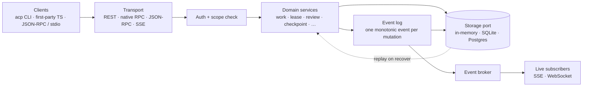
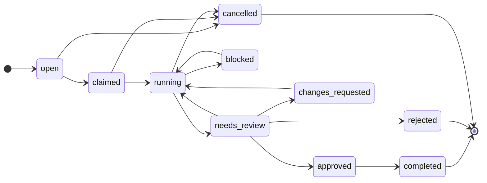

# Agent Coordination Protocol (ACP)

**ACP lets several autonomous coding agents share one repository without stepping
on each other.** It holds the durable facts that make cooperation safe — who is
working, what work exists, which files are claimed, what progress can be
recovered, and what still needs review — so independent agents coordinate through
shared _state_ instead of a shared conversation.

ACP says nothing about _how_ an agent thinks, edits files, or calls a model. It
only owns the workspace state that keeps parallel work from colliding.

> **Status:** v0.1, in active development. The full protocol surface is
> implemented and spec-conformant across every transport. This is the TypeScript
> reference implementation — a real, runnable coordination host you can drive
> today, with distribution and operational hardening still in progress.

> **Quick start for agents:** See [`ACP-SKILL.md`](./ACP-SKILL.md) — the exact
> CLI commands and workflow for autonomous agents integrating with ACP.

---

## The problem it solves

Point two agents at the same repo and things break in predictable ways:

- **They collide.** Both edit `login.ts` at the same time and one silently
  clobbers the other.
- **A crash loses everything.** An agent dies mid-task and its progress —
  which lived only in its conversation — is gone.
- **Review is blind.** A human (or another agent) can't tell what an agent
  actually did, or whether it's safe to merge.

Conversational memory can't fix this: it doesn't survive a restart and can't be
shared between two different agents. ACP moves those facts _out_ of any single
agent into a durable, replayable log. Every change appends a monotonic event, so
a recovering worker can replay history and catch up before it acts.

## Core concepts at a glance

| Concept        | What it gives you                                                        |
| -------------- | ------------------------------------------------------------------------ |
| **Workspace**  | The shared context (a repo, worktree, directory, container, CI job).     |
| **Worker**     | A registered actor (agent, bot, human, CI) with an identity and status.  |
| **Work unit**  | A task with an explicit lifecycle state machine.                         |
| **Lease**      | An advisory, TTL'd claim on a resource (e.g. a file) — prevents clashes. |
| **Checkpoint** | A resumable snapshot of partial progress, so a handoff survives a crash. |
| **Memory**     | Append-only, workspace-scoped facts for handoff between actors.          |
| **Artifact**   | A preserved output (a PR, a diff, a file) tied to a work unit.           |
| **Review**     | A gate for human (or agent) decisions on a work unit.                    |
| **Event**      | The append-only, per-workspace history of everything above.              |

---

## How it works

ACP is a single long-lived **host process**. Clients never talk to each other;
they talk to the host, and the host owns the durable state. Every transport —
REST, native RPC, JSON-RPC, SSE — is served over the **same application
graph**, so a workspace created over REST is immediately visible to a
JSON-RPC client and streams to an SSE subscriber. There is one `Storage`
instance behind them all.



A single mutation always takes the same path, whichever transport carries it:

1. **Authorize.** The transport resolves the actor and checks its scopes; a
   missing credential is `401`, an insufficient one is `403`.
2. **Apply.** A domain service validates the change against its invariants — a
   work-unit transition, a lease that isn't already held, a review gate that is
   green — and writes the new state through the `Storage` port.
3. **Record.** The same operation appends **exactly one** event to the
   workspace's strictly monotonic log (`workspace_id, seq`). State and history
   are written together, so they can never disagree.
4. **Fan out.** The event broker pushes the new event to any live SSE/WebSocket
   subscribers; durable replay stays backed by storage.

**Recovery is replay.** Because progress lives in the event log rather than any
agent's memory, a worker that crashes and restarts catches up by replaying
`events list --after <last_seq>` before it acts — no shared conversation, no lost
context. Storage (in-memory, SQLite, Postgres) and live fan-out (in-process,
`pg-notify`) are chosen at the host boundary behind ports, so the protocol
behaves identically from a laptop to a multi-replica deployment.

---

## Get started in 60 seconds

The fastest way to _use_ ACP is the Dockerized host plus the `acp` wrapper. One
command boots a persistent host with durable SQLite on a volume; a thin wrapper
runs the CLI inside it. No Node build, no token juggling.

```bash
# 1. Boot the host (builds the image on first run).
npm run acp:up            # == docker compose --profile sqlite up -d --build

# 2. Put the wrapper on your PATH so `acp ...` works from anywhere.
ln -s "$(pwd)/bin/acp" /usr/local/bin/acp
```

That's it — you now have a running coordination host. Everything you do with
`acp` executes inside the container against that host, and all state lives on a
named volume, so it survives restarts.

```bash
npm run acp:logs          # tail host logs
npm run acp:down          # stop (keeps your data)
docker compose down -v    # stop and wipe all state
```

> Requirements: Docker with Compose. The wrapper auto-detects the running host,
> refuses to run with a clear hint if none is up, and forwards `ACP_RPC_TOKEN`
> if you turn auth on.

## Your first coordinated task

This is the exact sequence a real worker follows — claim work, protect the file
it's about to edit, record recoverable progress, get reviewed, finish. It's the
same lifecycle the live-agent harness drives with fully autonomous agents.

```bash
# Create a workspace (kinds: git_repository, git_worktree, directory,
# container, cloud_sandbox, ci_job).
acp workspace create --name my-repo --kind git_repository \
  --uri "file:///path/to/repo" --default-branch main
# -> { "id": "workspace_...", ... }

# Open work in it.
acp work create "Fix login redirect" --workspace workspace_xxx --priority high
# -> { "id": "work_...", "state": "open", ... }

# Claim the work and lease the file you're about to touch.
acp work claim work_xxx --worker agent_codex
acp lease request --workspace workspace_xxx --holder agent_codex \
  --kind file --uri "file:///path/to/repo/src/login.ts" --ttl 300
#   -> a second worker requesting the same lease gets 409 lease_conflict.

# Go to work and record recoverable state as you go.
acp work update work_xxx --state running
acp checkpoint create --workspace workspace_xxx --work work_xxx \
  --summary "patched redirect target, tests green"
acp memory create --workspace workspace_xxx --work work_xxx \
  --kind handoff --key login-fix --summary "done" --content "notes for the reviewer"

# Register the output and ask for review (this performs running -> needs_review).
acp artifact pr --workspace workspace_xxx --work work_xxx \
  --url "https://github.com/org/repo/pull/42" --summary "Fix login redirect"
acp review request --work work_xxx --by agent_codex

# A reviewer approves, then the worker finishes and releases the file.
acp review approve review_xxx --met "correctness"   # -> work goes to approved
acp work update work_xxx --state completed
acp lease release lease_xxx

# Replay the story at any time, usually as a bounded tail, or stream it live.
acp events list --workspace workspace_xxx --after 0 --limit 25
acp events stream --workspace workspace_xxx
```

Restart the host in the middle of all that and nothing is lost:

```bash
docker compose restart acp
acp work list --workspace workspace_xxx   # still there
```

## Run it directly (no Docker)

Prefer to run the host as a plain Node process? Build once and start it. This is
the same protocol behavior — Docker just packages it.

```bash
pnpm install
pnpm build                                   # tsc -> dist/

# In-memory storage, no auth — the simplest local path.
ACP_PORT=4317 node dist/app/server/main.js

# ...or durable SQLite:
ACP_STORAGE_ADAPTER=sqlite ACP_SQLITE_PATH=.acp/acp.sqlite \
  ACP_PORT=4317 node dist/app/server/main.js
```

The `acp` CLI is a thin HTTP client of the host. Point it with `ACP_BASE_URL`
(defaults to `http://localhost:$ACP_PORT`); every command prints JSON on stdout.
Here `acp` is shorthand for `node dist/app/cli/main.js`:

```bash
export ACP_BASE_URL=http://localhost:4317
acp session init --worker agent_codex --name Codex --kind agent \
  --permissions workspace:read,workspace:write,work:create \
  --workspace workspace_primary
```

`session init` returns a `session_id` used as the bearer token once auth is on
and reports its `workspace_ids` binding when one was requested. Repeat
`--workspace` or provide comma-separated identifiers to bind more than one
workspace; omitting the flag creates an unbound session.

---

## Concepts in depth

### Work lifecycle

A work unit is a small state machine, and that machine is the contract every
transport enforces identically. The server rejects any jump the machine doesn't
allow with `invalid_state_transition` (HTTP 409), and every accepted transition
appends exactly one event to the workspace log — so the state a work unit is in
and the history of how it got there are the same fact, read two ways.



Read it in three parts:

- **The happy path** is `open → claimed → running → needs_review → approved →
completed`. A worker claims open work, starts it, submits it for review, and
  finishes once the gate is green.
- **The review loop** is what makes work correct rather than merely done. From
  `needs_review` a reviewer can `approve`, `reject` (terminal), or
  `request-changes` — which returns the unit to `changes_requested → running` so
  the worker writes a fresh checkpoint and resubmits. A worker can also pull work
  straight back to `running` to keep editing before any verdict lands.
  `blocked ⇄ running` is the same idea for a worker that hits an external
  dependency.
- **Terminal states** are `completed`, `rejected`, and `cancelled`. `cancelled`
  is reachable from any pre-review state to abandon work cleanly; nothing leaves
  a terminal state.

Each edge is a named event, which is what a recovering worker replays to
reconstruct where a unit stands:

| Transition                         | CLI / trigger                   | Event emitted              |
| ---------------------------------- | ------------------------------- | -------------------------- |
| `open → claimed`                   | `work claim`                    | `work.claimed`             |
| `claimed → running`                | `work update --state running`   | `work.started`             |
| `running → needs_review`           | `review request`                | `work.needs_review`        |
| `running → blocked`                | `work update --state blocked`   | `work.blocked`             |
| `blocked → running`                | `work update --state running`   | `work.unblocked`           |
| `needs_review → approved`          | `review approve`                | `review.approved`          |
| `needs_review → changes_requested` | `review request-changes`        | `review.changes_requested` |
| `needs_review → rejected`          | `review reject`                 | `review.rejected`          |
| `approved → completed`             | `work update --state completed` | `work.completed`           |
| `* → cancelled`                    | `work update --state cancelled` | `work.cancelled`           |

### Leases

A lease is an **advisory** TTL'd claim on a resource identified by `kind` +
`uri`. Requesting one already held by another worker returns `409
lease_conflict`. Long work can `renew`; a supervisor can `revoke` a stale one;
`lease list` inspects workspace lease state. Leases coordinate — they do not lock
the filesystem.

### Reviews

A review gates a decision on a work unit. Cancellation is its own lifecycle
event (`review.cancelled`), distinct from rejection: cancelling a requested
review withdraws the gate and lets the work continue rather than failing it.

### The review gate

A review is more than approve/reject. A reviewer can anchor **diff-anchored
comments** to a file and line on an artifact and open a **grill** — a set of
forced senior-level questions the worker must answer. The gate passes only when
every blocker question is `accepted` and every review comment is `resolved`:

1. **Comment.** Reviewer: `review comment --review <id> --work <id> --workspace
<id> --artifact <id> --file <f> --side new --body "…"`. The worker addresses it
   and the reviewer runs `review comment resolve <comment_id>`.
2. **Grill.** Reviewer: `grill open …`, then `grill ask <grill_id> --severity
blocker --prompt "…"`. The worker answers with `grill answer <question_id>
--answer "…"`; the reviewer records `grill verdict <question_id> --accept`.
3. **Evaluate.** Reviewer: `grill evaluate <grill_id>` computes pass/fail —
   `passed` requires every blocker accepted and every comment resolved.
4. **Approve.** On a green gate, `review approve <id> --met <csv>`.

The `work resume <id>` packet carries `open_comments` and `latest_grill`, so a
returning reviewer sees outstanding gate obligations in a single read.

### GitHub-driven workflow (optional)

`acp gh` binds the ACP review gate to a real GitHub pull request. It is a
CLI-only bridge over the `gh` CLI (using `gh`'s own auth — ACP never reads,
stores, or forwards a token); the protocol host has no GitHub dependency.

- `acp gh import <pr> --work <id> --workspace <id>` — pull the PR diff into a
  `diff` artifact and a `pull_request` artifact on the work.
- `acp gh sync <pr> --work <id> --review <id> --artifact <id>` — idempotent
  two-way reconcile of review comments between ACP and the PR (imports GitHub
  comments, posts ACP comments, propagates resolution). Safe to re-run.
- `acp gh merge <pr> --work <id> [--method squash|merge|rebase]` — post the ACP
  decision as a PR comment, then merge **only if** the gate is green (a review
  approved, the latest grill passed, no open comments). A blocked merge exits
  non-zero and never merges.

`<pr>` is a PR URL or `owner/repo#number`.

### Events

Every workspace has an append-only, strictly monotonic event log
(`workspace_id, seq`). It is the source of truth for ordering and the recovery
mechanism: a returning worker replays `events list --after <seq> --limit <n>`
before opening a live subscription, keeping context recovery proportional to the
tail it actually needs. Worker presence, by contrast, is host-scoped current
state (`worker list` / `worker get`), not derived from event history.

---

## Transports

Every transport runs against the **same** application graph, so sessions,
workspaces, leases, events, memory, checkpoints, artifacts, and reviews are
shared no matter how a client connects.

| Transport           | Endpoint / entry           | Use it for                                          |
| ------------------- | -------------------------- | --------------------------------------------------- |
| **REST**            | `/v1/...`                  | The primary HTTP surface; what the CLI speaks.      |
| **SSE**             | `GET /v1/events/stream`    | Workspace-scoped live events over HTTP.             |
| **Native RPC**      | `/rpc/native` (NDJSON)     | First-party TypeScript clients using `@effect/rpc`. |
| **JSON-RPC (POST)** | `POST /rpc`                | Compatibility; 2.0 envelopes, batch, notifications. |
| **JSON-RPC (WS)**   | `GET /rpc` (upgrade)       | The same JSON-RPC surface over a persistent socket. |
| **stdio bridge**    | `acp-jsonrpc-stdio` binary | Content-Length framed JSON-RPC for stdio clients.   |

**Native RPC** is the recommended path for new first-party TypeScript consumers:
one NDJSON path serves both unary calls and `events.subscribe` streaming, and
every operation carries structured Effect telemetry (operation, outcome,
duration, client id, ACP error code). **JSON-RPC** is the compatibility surface —
every REST mutation has a paired method — not the focus of new client work.

---

## Deploying for real

The host is a single long-lived process, so it runs on any **persistent
container platform** (Railway, Fly.io, Render, a VM, Kubernetes) — not
serverless. Two unauthenticated probes report health before any session exists:

| Probe         | Endpoint      | Meaning                                                              |
| ------------- | ------------- | -------------------------------------------------------------------- |
| **Liveness**  | `GET /health` | `200` while the process serves; makes no backend calls.              |
| **Readiness** | `GET /ready`  | `200` when storage answers, `503` when it is unreachable (drain it). |

Point your platform's health check at `/ready`. The multi-stage
[`Dockerfile`](./Dockerfile) builds a non-root image whose `HEALTHCHECK` already
targets it.

### Scale out: the `ha` Compose profile

When one node isn't enough, the **`ha` profile** boots the ADR-0008
`self-host-ha` stack — Postgres storage plus `pg-notify` cross-replica event
fan-out — ready to scale to multiple hosts:

```bash
npm run acp:ha:up      # docker compose --profile ha up -d --build (Postgres + host)
acp work create ...    # ./bin/acp auto-detects the acp-ha host service
npm run acp:ha:down
```

Run one profile at a time (both publish `4317`). The
[`docker.yml`](./.github/workflows/docker.yml) CI workflow guards both paths on
every PR — it runs the Docker-hosted CLI dogfood and drives the Postgres profile
through the same coordination lifecycle a real multi-agent deployment uses. The
same image runs every profile; only environment differs. See
[`wiki/references/deployment.md`](./wiki/references/deployment.md) for the
platform-by-platform runbook.

### Optional edge proxy (Traefik)

Front the ACP host with a free, clone-and-go reverse proxy:

```bash
npm run acp:edge:up        # sqlite base + Traefik edge
# or: npm run acp:ha:edge:up

# through the proxy (self-signed TLS):
curl -k -H 'Host: acp.localhost' https://127.0.0.1/ready
```

Traefik serves `https://acp.localhost` (self-signed cert), a dashboard on
`http://127.0.0.1:8080`, and load-balances across HA replicas
(`docker compose --profile ha --profile edge up --scale acp-ha=3`). The first HA
replica keeps raw host port `4317` for `./bin/acp`; scaled replicas receive the
next available ports in `4318`–`4326`, while Traefik reaches every replica on
its internal `4317` endpoint. The unauthenticated dashboard is loopback-only;
production deployments must secure or disable it and restrict Docker API
access.

**Opt-in basic-auth** (demo): generate a hash and attach the middleware —
`htpasswd -nbB acp acp` → add an `acp-auth` `basicAuth` middleware to
`traefik/dynamic.yml` and append `acp-auth@file` to the router's
`traefik.http.routers.acp.middlewares` label.

### Storage adapters

Storage is selected at the host boundary behind a single port, so persistence is
an adapter concern, not a protocol concern.

- **In-memory** (default) — deterministic, ephemeral. Good for the local happy
  path and tests.
- **SQLite** (`ACP_STORAGE_ADAPTER=sqlite`, `ACP_SQLITE_PATH=...`) — durable
  state and an append-only event table, created on startup.
- **Postgres** (`ACP_STORAGE_ADAPTER=postgres`, `ACP_DATABASE_URL=...`) — the
  network-durable adapter (via `@effect/sql-pg`, pooled, migrations on startup)
  for multi-replica hosting. Per-workspace event `seq` is allocated atomically,
  so concurrent writers across processes never collide; the host fails fast at
  boot if `ACP_DATABASE_URL` is unset.

Live event fan-out is chosen separately: `ACP_EVENT_BROKER=in-process` (default)
is the single-node broker; `ACP_EVENT_BROKER=pg-notify` delivers SSE/WebSocket
notifications across replicas while replay stays backed by durable storage.

### Authentication and scopes

Local mode allows unauthenticated requests. Set `ACP_REQUIRE_AUTH=true` to
require bearer sessions on scoped routes.

- `session.initialize` is the open bootstrap route; it mints the session id used
  as the bearer token on later calls.
- Session ids are opaque, high-entropy credentials (not counters or timestamps).
- Permissions are explicit strings — `work:create`, `lease:create`,
  `review:approve`, `event:read`, and so on.
- Missing/invalid credentials return `401`; a valid token lacking the required
  scope returns `403` with the `forbidden` error code.

The CLI and stdio bridge forward `ACP_RPC_TOKEN` as the bearer token, so an
integration can `export ACP_RPC_TOKEN=$(...)` once and reuse the scoped session
without ACP storing any credentials.

---

## Configuration

`.env.example` is the drift-checked runtime manifest for the host, CLI, stdio
bridge, and scripts. Copy it for local use; inject secrets from the operator
shell rather than committing them.

| Variable                         | Purpose                                                                        |
| -------------------------------- | ------------------------------------------------------------------------------ |
| `ACP_PORT`                       | Host bind port (default `4317`).                                               |
| `ACP_BASE_URL`                   | Target host for the CLI / stdio bridge.                                        |
| `ACP_PROFILE`                    | Optional deployment preset (`local`, `single-node`, `hosted`, `self-host-ha`). |
| `ACP_STORAGE_ADAPTER`            | `memory` (default), `sqlite`, or `postgres`.                                   |
| `ACP_SQLITE_PATH`                | SQLite database path (required for the sqlite adapter).                        |
| `ACP_DATABASE_URL`               | Postgres connection string for postgres-backed adapters.                       |
| `ACP_EVENT_BROKER`               | `in-process` (default) or `pg-notify`.                                         |
| `ACP_REQUIRE_AUTH`               | `true` to require bearer sessions on scoped routes.                            |
| `ACP_REQUIRE_WORKSPACE_BINDINGS` | `true` to require `workspace_ids` during session initialization.               |
| `ACP_RPC_TOKEN`                  | Bearer token forwarded by the CLI / stdio bridge.                              |
| `ACP_LOG_LEVEL`                  | `debug` \| `info` (default) \| `warn` \| `error`.                              |
| `ACP_DEFAULT_LEASE_TTL`          | Default lease TTL when a request omits one.                                    |
| `ACP_SESSION_TTL`                | Session lifetime.                                                              |
| `ACP_SWEEP_INTERVAL`             | Background sweeper cadence (expiring leases/sessions).                         |
| `ACP_SSE_HEARTBEAT`              | SSE keepalive interval.                                                        |
| `ACP_EVENT_RETENTION_DAYS`       | Event history retention window.                                                |
| `ACP_MAX_ARTIFACT_SIZE_MB`       | Inline artifact content size cap.                                              |

## CLI command reference

```
session init      --worker <id> --name <n> [--kind <k>] [--vendor <v>] [--capabilities <csv>] [--permissions <csv>] [--workspace <id[,id...]> ...]
worker  list | get <worker_id>
workspace create | update <id> | archive <id> | list
work    create <title> --workspace <id> [--priority <p>] [--description <d>]
work    list --workspace <id> [--state <state>] [--priority <p>] [--assigned-to <worker_id>] | get <id> | resume <id> | claim <id> --worker <id> | update <id> --state <state>
lease   request --workspace <id> --holder <id> --kind <k> --uri <u> [--ttl <n>]
lease   list --workspace <id> [--holder <holder>] | renew <id> [--ttl <n>] | revoke <id> | release <id>
checkpoint create --workspace <id> --work <id> --summary <s> | list | latest --work <id>
artifact create | pr | update <id> | list [--kind <kind>] | content <id> | delete <id>
review  request --work <id> --by <id> | list | approve <id> --met <csv> | reject <id> | request-changes <id> | cancel <id>
review  comment --review <id> --work <id> --workspace <id> --artifact <id> --file <f> --side old|new --body <t> [--line <n>] [--reply-to <id>]
review  comment resolve <comment_id> | reopen <comment_id> | list --review <id>|--work <id>
grill   open --review <id> --work <id> --workspace <id> | ask <grill_id> --severity blocker|major|minor --prompt <q>
grill   answer <question_id> --answer <t> | verdict <question_id> --accept|--reject
grill   evaluate <grill_id> | get <grill_id> | list --review <id>
gh      import <pr> --work <id> --workspace <id> | sync <pr> --work <id> --review <id> --artifact <id>
gh      merge <pr> --work <id> [--method squash|merge|rebase]
memory  create --workspace <id> --kind <k> --key <k> --summary <s> --content <c> [--work <id>] [--labels <csv>]
memory  list --workspace <id> [--after <seq>] [--limit <n>] [--work <id>] [--kind <k>] [--key <k>] [--label <l>]
events  list --workspace <id> [--after <seq>] [--type <event_type>] | stream --workspace <id>
```

`<pr>` is a PR URL or `owner/repo#number`. The `gh` bridge requires the `gh` CLI
installed and authenticated (it uses `gh`'s own auth — ACP never handles a token).

Run `node dist/app/cli/main.js` with no arguments (or `acp` with none) to print
the full usage text.

---

## Testing and dogfooding

The verification path is TypeScript typechecking, ESLint, and the full Vitest
suite:

```bash
pnpm typecheck
pnpm lint
pnpm test
```

`tsconfig.json` owns full-source typechecking and test discovery.
`tsconfig.build.json` is the production-emission boundary: `pnpm build` cleans
`dist`, excludes test-only TypeScript, and fails if a test or fixture module is
still emitted. The Docker builder copies both configurations and runs that same
checked production build.

Production images use msgpackr's supported pure-JavaScript decoder path.
`pnpm-workspace.yaml` declines only the optional `msgpackr-extract` install
script, while the runtime sets `MSGPACKR_NATIVE_ACCELERATION_DISABLED=true`.
The addon accelerates string decoding but is not required for transport
correctness; native Effect RPC remains covered by the Docker self-dogfood gate.

Beyond unit tests, several lanes exercise ACP against a _live_ host:

- **`pnpm dogfood:docker-self`** — builds the production image once. It
  exercises every local domain and transport through the compiled public entry
  points,
  restarts the SQLite container to prove named-volume durability, verifies
  bearer permissions and workspace binding, then reuses the image for the HA
  and edge gates. The authenticated GitHub bridge remains an explicit opt-in
  sandbox gap tracked in issue #268.
- **`node scripts/acp-docker-cli-dogfood.mjs`** (`dogfood:docker-cli`) — builds
  the production image, runs ACP as a container, and drives the compiled CLI
  inside it through a full workspace/work/review lifecycle, verifying the
  replayed event types. This is the proof the daily-driver image is real.
- **`node scripts/acp-docker-ha-dogfood.mjs`** (`dogfood:docker-ha`) — runs the
  Compose `ha` profile with separate planner, worker, and reviewer identities,
  forces claim and lease races, proves Postgres event fan-out across two host
  replicas, verifies the sweeper emits exactly one lease-expiry event, restarts
  the hosts mid-lifecycle, and replays the monotonic event history.
- **`node scripts/acp-docker-edge-smoke.mjs`** (`dogfood:docker-edge`) — fronts
  both the SQLite and two-replica HA profiles with Traefik, then verifies
  HTTP/HTTPS routing, security headers, dashboard health, and exact backend
  discovery.
- **`scripts/live-test/`** — the real-agent harness: genuinely autonomous agents
  (planner / two workers / reviewer), each given only a role and the `acp` CLI,
  coordinate through a live SQLite-backed, auth-on host. A verifier then asserts
  six invariants — monotonic event seq, real lease contention, a
  request-changes→approve loop, terminal states with no dangling leases,
  cross-actor handoff, and API↔SQLite durability parity.

The package also exposes an `acp-jsonrpc-stdio` binary that reads Content-Length
framed JSON-RPC from stdin, forwards it to the host's `POST /rpc`, and writes
framed responses to stdout.

---

## License

Apache-2.0. See [`LICENSE`](LICENSE).
