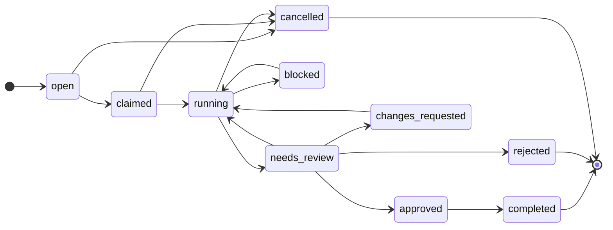

# Work Unit

- **Definition:** A unit of work to be completed, owned by a [[Workspace]], driven
  through an explicit lifecycle by a [[Worker]].
- **Canonical name:** Work Unit (`work`). Never "task", "ticket", "job".
- **Not:** a [[Lease]] (a claim on a resource) nor an [[Artifact]] (an output).
- **Lifecycle states:** `open · claimed · running · blocked · needs_review ·
changes_requested · approved · rejected · completed · cancelled` (state machine
  in spec §14).
- **Seams:** persisted through the [[Storage]] seam; mutations emit [[Event]]s
  through [[EventStore]], then stream through the [[EventStream]] seam.
- **Example:** `work_123` "Fix login redirect bug", priority high, created by `human_chris`.

## State Machine (authoritative)

Happy path: `open → claimed → running → needs_review → approved → completed`.
`blocked ⇄ running` and `changes_requested → running` are the two return loops;
`cancelled` is reachable from any pre-review state; `completed`, `rejected`, and
`cancelled` are terminal. The authoritative edge set lives in `allowedTransitions`
in [[work-unit-service]].

`changes_requested` is part of [[WorkUnit]] state because the spec §14 state
machine requires it, even though the §10.3 allowed-state prose omitted it.

Invalid transition ⇒ `InvalidStateTransitionError` ⇒ HTTP `409`.

## Referenced by

[[work-unit-service]] · [[work-unit-service-index]]
