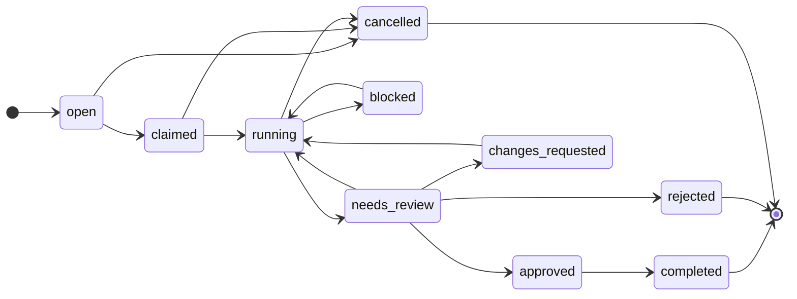

# Agent Integration — How an Autonomous Worker Uses ACP

Canonical source of truth for the root [`ACP-SKILL.md`](@root/ACP-SKILL.md)
projection. This page describes the contract an autonomous worker (agent, bot,
CI, or human) follows to coordinate through an ACP host without a shared
conversation. The skill file at the root is a faithful projection of this page —
edit here first, then re-project.

Every claim on this page was validated live against the Dockerized host
(`docker compose --profile sqlite up`, driven through [`bin/acp`](@root/bin/acp)):
the full lifecycle replays as the event sequence recorded in the
[Grill Log](#grill-log) below.

## Mental model

ACP holds the durable facts that let independent workers share one workspace
safely. An agent never coordinates by talking to another agent; it **reads and
writes protocol state**, and every mutation appends a monotonic event so a
recovering worker can replay history and catch up before acting.

| Concept        | The agent's use of it                                                    |
| -------------- | ------------------------------------------------------------------------ |
| **Workspace**  | The shared context it operates in (a repo, worktree, container, CI job). |
| **Worker**     | Its own registered identity and status.                                  |
| **Work unit**  | A task with an explicit lifecycle state machine it drives.               |
| **Lease**      | An advisory, TTL'd claim it takes on a file before editing.              |
| **Checkpoint** | A resumable snapshot it writes so a crash/handoff survives.              |
| **Memory**     | Append-only facts it leaves for the next actor.                          |
| **Artifact**   | A preserved output (PR, diff, file) it attaches to the work.             |
| **Review**     | The gate it requests and a reviewer resolves.                            |
| **Event**      | The append-only per-workspace log it replays to recover.                 |

## Connecting to a host

Two supported paths. Both speak to the same application graph.

1. **Dockerized daily driver (recommended).** The host runs as a container; the
   [`bin/acp`](@root/bin/acp) wrapper runs the CLI inside it. With the default
   `local` profile (`ACP_REQUIRE_AUTH=false`) no token is needed and mutations
   attribute to `worker_system`.

   ```bash
   npm run acp:up                       # docker compose --profile sqlite up -d --build
   ln -s "$(pwd)/bin/acp" /usr/local/bin/acp
   acp workspace list                   # every command runs inside the container
   ```

2. **Direct HTTP.** The CLI is a thin client of the REST surface. Point it at a
   running host and it prints JSON on stdout:

   ```bash
   export ACP_BASE_URL=http://localhost:4317
   node dist/app/cli/main.js workspace list
   ```

When the host has `ACP_REQUIRE_AUTH=true`, the agent must bootstrap a session
first and forward the returned id as the bearer token (`ACP_RPC_TOKEN`). See
[Authentication](#authentication).

## The operating loop

The canonical sequence a worker follows. Each step is a real command, verified
against the live host.

1. **Register** (auth-on hosts only). `session init` mints a `session_id` used as
   the bearer token, scoped to explicit permissions.
2. **Find or open work.** `work list --workspace <id>` to discover open work, or
   `work create` to open your own.
3. **Claim it.** `work claim <work_id> --worker <you>` — moves `open → claimed`.
4. **Lease every resource you will mutate.** `lease request` before editing a
   file. A lease already held returns `409 lease_conflict`; back off or wait.
5. **Go running.** `work update <id> --state running`.
6. **Record recoverable state as you work.** `checkpoint create` for resumable
   snapshots; `memory create --kind handoff` for facts the next actor needs.
7. **Register outputs.** `artifact pr` (or `artifact create`) attaches the PR/
   diff/file to the work.
8. **Request review.** `review request --work <id> --by <you>` performs
   `running → needs_review`.
9. **Handle the verdict.** A reviewer may leave diff-anchored comments and open a
   grill of blocker questions before deciding (see [The review gate](#the-review-gate)).
   - `approved` → proceed to finish.
   - `changes_requested` → return to `running`, resolve open comments, write a
     fresh checkpoint, re-request review.
10. **Finish and release.** `work update <id> --state completed`, then
    `lease release <lease_id>` for every lease you hold.
11. **Recover, any time.** After a restart, read a bounded current handoff with
    `work resume <id> --budget <n>`. Replay events from the last seen sequence,
    then open a live `events stream` — never act on stale in-process state.

## Work lifecycle

Illegal transitions return `invalid_state_transition` (HTTP 409).



Happy path: `open → claimed → running → needs_review → approved → completed`.
`review request` is the only path that performs `running → needs_review`;
`request-changes` sends work to `changes_requested → running`; `blocked ⇄
running` covers external stalls. `completed`, `rejected`, and `cancelled` are
terminal, and `cancelled` is reachable from any pre-review state.

## The review gate

A review is more than approve/reject. A reviewer can anchor **diff-anchored
comments** to a file and line on an artifact and open a **grill** — a set of
forced senior-level questions the worker must answer. The gate passes only when
every blocker question is `accepted` and every review comment is `resolved`:

1. **Comment.** Reviewer: `review comment --review <id> --work <id> --workspace
<id> --artifact <id> --file <f> --side new --body "…"`. The worker addresses it
   and the reviewer runs `review comment resolve <comment_id>`.
2. **Grill.** Reviewer: `grill open …`, then `grill ask <grill_id> --severity
blocker --prompt "…"`. The worker answers with `grill answer <question_id>
--answer "…"`; the reviewer records `grill verdict <question_id> --accept`.
3. **Evaluate.** Reviewer: `grill evaluate <grill_id>` computes pass/fail —
   `passed` requires every blocker accepted and every comment resolved.
4. **Approve.** On a green gate, `review approve <id> --met <csv>`.

The `work resume <id>` packet carries `open_comments` and `latest_grill`, so a
returning reviewer sees outstanding gate obligations in a single read.

For long-running work, prefer `acp work resume <id> --budget <n>`. The bounded
packet always keeps `work`, `latest_checkpoint`, `open_comments`, and
`latest_grill` inline; it keeps the most-recent artifact metadata and review
records up to the requested capacity, then reports the remainder under
`elided.artifacts` / `elided.reviews` as `{count, ids}` references. Approved
reviews and the review tied to `latest_grill` are pinned even when that exceeds
the budget, so context shaping cannot hide a merge-gate obligation. Omit
`--budget` when you need the full backward-compatible packet.

Direct HTTP clients also receive a stable `ETag` from
`GET /v1/work/<id>/resume` (including budgeted reads). Re-send it in
`If-None-Match`; unchanged state returns `304` with no response body. Any packet
change, including an elided entity, invalidates the tag. The CLI exposes
`--budget` today but does not persist/re-send ETags for you.

## GitHub-driven workflow (optional)

`acp gh` binds the ACP review gate to a real GitHub pull request. It is a
CLI-only bridge over the `gh` CLI (using `gh`'s own auth — ACP never reads,
stores, or forwards a token); the protocol host has no GitHub dependency.

- `acp gh import <pr> --work <id> --workspace <id>` — pull the PR diff into a
  `diff` artifact and a `pull_request` artifact on the work.
- `acp gh sync <pr> --work <id> --review <id> --artifact <id>` — idempotent
  two-way reconcile of review comments between ACP and the PR (imports GitHub
  comments, posts ACP comments, propagates resolution). Safe to re-run.
- `acp gh merge <pr> --work <id> [--method squash|merge|rebase]` — post the ACP
  decision as a PR comment, then merge **only if** the gate is green (a review
  approved, the latest grill passed, no open comments). A blocked merge exits
  non-zero and never merges.

## Command surface

Authoritative surface (from the container's own usage text):

```
session    init      --worker <id> --name <n> [--kind <k>] [--vendor <v>] [--capabilities <csv>] [--permissions <csv>]
worker     list | get <worker_id>
workspace  create --name <n> --kind <k> --uri <u> [--default-branch <b>] | update <id> | archive <id> | list
work       create <title> --workspace <id> [--priority <p>] [--description <d>]
work       list --workspace <id> | get <id> | resume <id> [--budget <n>] | claim <id> --worker <id> | update <id> --state <state>
lease      request --workspace <id> --holder <id> --kind <k> --uri <u> [--ttl <n>]
lease      list --workspace <id> | renew <id> [--ttl <n>] | revoke <id> | release <id>
checkpoint create --workspace <id> --work <id> --summary <s> | list --work <id>|--workspace <id> | latest --work <id>
artifact   create --workspace <id> --work <id> --kind <k> [--uri <u>] [--summary <s>] [--content <c>]
artifact   pr --workspace <id> --work <id> --url <u> [--summary <s>] | update <id> | list | content <id> | delete <id>
review     request --work <id> --by <id> [--reviewer <id>] | list --work <id>|--workspace <id>
review     approve <id> --met <csv> [--signature <s> --signature-algorithm <alg> --signature-key <key-id> [--signed-at <iso>]]
review     reject <id> | request-changes <id> | cancel <id>
review     comment --review <id> --work <id> --workspace <id> --artifact <id> --file <f> --side old|new --body <t> [--line <n>] [--reply-to <id>]
review     comment resolve <comment_id> | reopen <comment_id> | list --review <id>|--work <id>
grill      open --review <id> --work <id> --workspace <id> | ask <grill_id> --severity blocker|major|minor --prompt <q>
grill      answer <question_id> --answer <t> | verdict <question_id> --accept|--reject
grill      evaluate <grill_id> | get <grill_id> | list --review <id>
gh         import <pr> --work <id> --workspace <id> | sync <pr> --work <id> --review <id> --artifact <id>
gh         merge <pr> --work <id> [--method squash|merge|rebase]
memory     create --workspace <id> --kind <k> --key <k> --summary <s> --content <c> [--work <id>] [--labels <csv>]
memory     list --workspace <id> [--after <seq>] [--limit <n>] [--work <id>] [--kind <k>] [--key <k>] [--label <l>]
events     list --workspace <id> [--after <seq>] | stream --workspace <id>
```

`<pr>` is a PR URL or `owner/repo#number`. The `gh` bridge requires the `gh` CLI
installed and authenticated (it uses `gh`'s own auth — ACP never handles a token).

`workspace kind` ∈ `git_repository | git_worktree | directory | container |
cloud_sandbox | ci_job`.

## Errors an agent must handle

Every command prints JSON; failures are `{"error":{"code":...,"message":...}}`.

| Code                       | HTTP | When                         | Correct response                                    |
| -------------------------- | ---- | ---------------------------- | --------------------------------------------------- |
| `lease_conflict`           | 409  | Resource already leased.     | Back off, wait/retry, or coordinate — do not force. |
| `invalid_state_transition` | 409  | Illegal work-state jump.     | Re-read `work get`; only take legal transitions.    |
| `unauthorized`             | 401  | Missing/invalid credentials. | Bootstrap or refresh the session token.             |
| `forbidden`                | 403  | Valid token lacks the scope. | Request a session with the needed permission.       |
| `not_found`                | 404  | Unknown id.                  | Re-list to resolve a current id.                    |

`conflict` and `rate_limited` are reserved codes with no current producer — do
not depend on them.

## Multi-agent etiquette

- **Leases are advisory.** They coordinate intent; they do not lock the
  filesystem. Respect a `lease_conflict` rather than editing anyway.
- **Do not forge lifecycle events.** A worker may only publish
  `work.progressed`; lifecycle transitions come from the state machine.
- **Replay before you act.** On resume, `events list --after <seq>` is the
  recovery contract — presence (`worker list`) is current state, not history.
- **Leave handoff memory.** The next actor has no access to your conversation;
  `memory create --kind handoff` is how context crosses the boundary.

## Authentication

Local mode allows unauthenticated requests. On `ACP_REQUIRE_AUTH=true` hosts:

- `session init` is the open bootstrap route; it returns the `session_id` used as
  the bearer token on later calls.
- Permissions are explicit strings — `work:create`, `lease:create`,
  `review:approve`, `event:read`, and so on.
- The CLI and stdio bridge forward `ACP_RPC_TOKEN`, so an integration can
  `export ACP_RPC_TOKEN=$(...)` once and reuse the scoped session.

## Transports

The CLI speaks REST (`/v1/...`), the primary surface. Other first-party clients
may use **Native RPC** (`/rpc/native`, NDJSON, `@effect/rpc`) which serves unary
calls and `events.subscribe` streaming over one path; **JSON-RPC** (`POST /rpc`,
WS `GET /rpc`) is the compatibility surface; the `acp-jsonrpc-stdio` binary
bridges Content-Length framed JSON-RPC for stdio integrations. See
[[deployment]] for hosting and [[acp-http-api]] for the wire contract.

## Grill Log

**Q: What name/location for the agent-facing skill?**
Decision: root `ACP-SKILL.md`, projected from this page. Rejected reusing
`SKILL.md` (owned by the FMCF governance protocol) and burying it under
`.claude/skills/` (the user asked for a root file any agent harness can read).

**Q: Should the skill assume auth on or off?**
Decision: document the auth-off Docker daily driver as the default path (matches
the shipped `local` compose profile) and treat auth as an explicit opt-in
section. Rejected making session bootstrap mandatory in the happy path — it would
misrepresent the out-of-the-box container.

**Q: How is accuracy guaranteed?**
Decision: every command was executed against the live container before writing.
The validated replay was:

```
workspace.created → work.created → work.claimed → lease.requested →
lease.granted → lease.requested → lease.denied (lease_conflict) →
work.started → checkpoint.created → memory.created → artifact.created →
review.requested → work.needs_review → review.approved → work.completed →
lease.released
```

Rejected documenting from the source/spec alone — the point of this slice was to
prove the container-driven workflow an agent will actually run.
